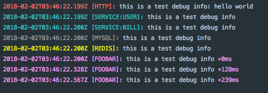

# go-debug

a colorful debug tool like [debug](https://github.com/visionmedia/debug) in golang.

## Install

```bash
$ dep ensure -add github.com/jjeffcaii/go-debug
```

## Example


```go
package main

import (
	"time"

	"github.com/jjeffcaii/go-debug"
)

func main() {
	// Set global flags
	debug.SetFlags(debug.UpperCase | debug.TimeUTC)
	// Env settings:
	// show all: DEBUG=*
	// show service only: DEBUG=service:*
	// show http and redis: DEBUG=http,redis
	debug.Debug("http").Printf("this is a test debug info: %s\n", "hello world")
	debug.Debug("service:user").Println("this is a test debug info")
	debug.Debug("service:bill").Println("this is a test debug info")
	debug.Debug("mysql").Println("this is a test debug info")
	debug.Debug("redis").Println("this is a test debug info")
	// print cost mills
	debug.Debug("foobar", debug.Mills).Println("this is a test debug info")
	time.Sleep(127 * time.Millisecond)
	debug.Debug("foobar", debug.Mills).Println("this is a test debug info")
	time.Sleep(234 * time.Millisecond)
	debug.Debug("foobar", debug.Mills).Println("this is a test debug info")
}

```


## Thanks
- [github.com/fatih/color](https://github.com/fatih/color)

